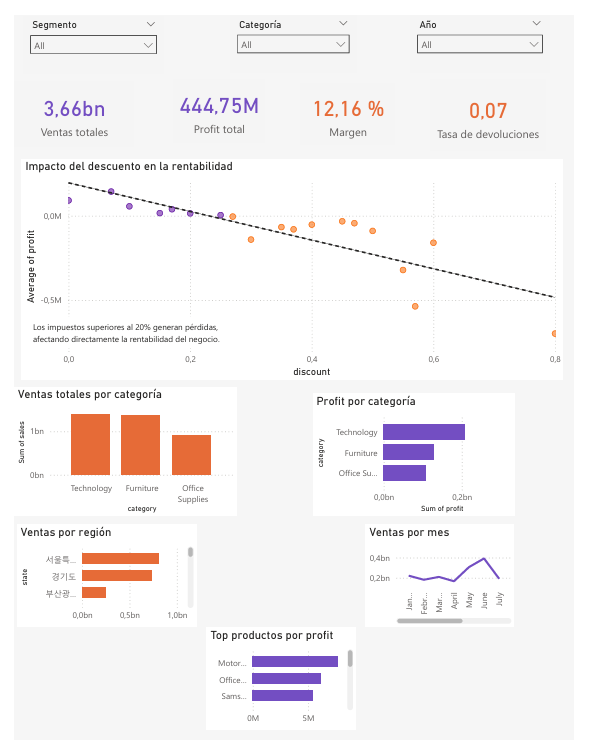

# 💳🏬 Superstore Korea 2025 - Análisis de Ventas y Rentabilidad

## 📌 Descripción del proyecto
Este proyecto tiene como objetivo analizar el comportamiento de ventas, rentabilidad y devoluciones en un dataset de retail en Corea del Sur.

Se exploran patrones clave del negocio como:
- Categorías más rentables
- Impacto de los descuentos en la rentabilidad
- Regiones con mayor desempeño
- Tendencias de ventas en el tiempo
- Tasa de devoluciones

El análisis se realizó utilizando Python (Pandas, Matplotlib) y se desarrolló un dashboard interactivo en Power BI.

---

## 🧰 Tecnologías utilizadas
- Python
- Pandas
- Matplotlib / Seaborn
- Power BI
- Jupyter Notebook

---

## 🧼 Limpieza de datos
Se realizaron las siguientes transformaciones:

- Renombrado de columnas (coreano → inglés)
- Traducción de variables categóricas
- Conversión de fechas a formato datetime
- Limpieza de la columna `returned`
- Validación de valores nulos y duplicados

Los datos finales están listos para análisis y visualización.

---

## 📊 Análisis exploratorio

### 💰 Ventas por categoría
Se identificó que **Office Supplies** es la categoría con mayor volumen de ventas.

### 📈 Rentabilidad por categoría
La categoría más rentable es **Technology**, indicando mejores márgenes de ganancia.

### ⚠️ Impacto del descuento
Existe una relación negativa entre descuento y rentabilidad:

- A partir de ~27% de descuento, los productos comienzan a generar pérdidas
- Descuentos altos afectan directamente la utilidad del negocio

### 🌍 Ventas por región
Las regiones con mayor volumen de ventas son:
- 서울특별시 (Seúl)
- 경기도 (Gyeonggi)

Estas representan los principales mercados del negocio.

### 📅 Tendencia de ventas
- Crecimiento sostenido entre 2023 y 2025
- Picos de ventas en junio, agosto, octubre y noviembre
- Máximo histórico en noviembre 2025

### 🔄 Tasa de devoluciones
La tasa de devoluciones es aproximadamente **7.14%**, lo cual es un nivel moderado pero con impacto en la rentabilidad.

---

## 🧠 Conclusiones
- Office Supplies lidera en ventas, pero no en rentabilidad
- Technology es la categoría más rentable
- Descuentos altos generan pérdidas significativas
- Existen regiones clave que concentran la mayor parte de las ventas
- Las devoluciones afectan la utilidad del negocio

---

## 💡 Recomendaciones
- Revisar la estrategia de descuentos (especialmente >20%)
- Potenciar productos de la categoría Technology
- Optimizar operaciones en Furniture
- Expandir presencia en regiones con menor participación
- Analizar causas de devoluciones

---

## 📊 Dashboard (Power BI)
El dashboard permite explorar de forma interactiva:

- Cards principales (ventas, profit, margen, devoluciones)
- Impacto del descuento en la rentabilidad
- Ventas por categoría y región
- Tendencias mensuales
- Top productos más rentables



📌 *El archivo .pbix se encuentra en este repositorio.*

---

## 📂 Estructura del proyecto

```bash
superstore-korea-analysis/
│
├── data/
│   ├── KR_Superstore_sample_2025.csv
│   └── KR_superstore_clean.csv
│
├── images/
│   └── dashboard.png
│
├── notebook/
│   └── analysis.ipynb
│   
├── powerbi/
│   └── superstore_korea_sales_dashboard.pbix
└── README.md

```
---

## 🐍 Proyecto en Python
Este proyecto fue desarrollado en Python por **Barbara Badillo** para análisis de datos.

